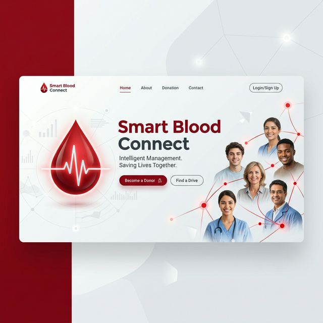

<div align="center">



# 🩸 Smart Blood Connect

### **Saving Lives Through Real-Time Connectivity**

[](https://github.com/)
[](https://reactjs.org/)
[](https://vitejs.dev/)
[](https://tailwindcss.com/)
[](https://supabase.com/)

---

**Smart Blood Connect** is a cutting-edge, real-time blood donation management system designed to bridge the gap between donors, patients, and healthcare institutions. Originally conceived in Flutter and now modernized for the web, it provides a seamless, life-saving interface for managing blood requests and donations.

[Quick Start](#-quick-start) • [Key Features](#-key-features) • [Tech Stack](#-tech-stack) • [Project Structure](#-project-structure)

</div>

## ✨ Key Features

- 🔐 **Multi-Level Authentication**: Secure access for Donors, Patients, Hospitals, and Admins.
- 🆘 **Emergency SOS**: Post critical blood requests with urgency levels (Critical, Urgent, Normal).
- 📍 **Smart Proximity Search**: Find donors and hospitals by city with distance-based sorting.
- ⚡ **Real-Time Notifications**: Instant updates on request status and matching donors using Supabase Realtime.
- 📊 **Inventory Management**: Specialized dashboards for hospitals to track blood stock.
- 📈 **Admin Insights**: Full-featured admin dashboard with real-time statistics and analytics.
- 🌍 **State-Wide Directory**: Comprehensive browser for blood institutions across different states.
- 📱 **Mobile First**: Fully responsive design optimized for all screen sizes.

---

## 🛠️ Tech Stack

### **Frontend**
- **React 18**: Component-based UI library.
- **Vite**: Ultra-fast build tool and dev server.
- **Zustand**: Lightweight, high-performance state management.
- **Tailwind CSS**: Utility-first CSS for premium aesthetics.
- **Lucide React**: Beautifully simple pixel-perfect icons.
- **React Hot Toast**: Elegant notification feedback.

### **Backend & Infrastructure**
- **Supabase**: Open-source Firebase alternative (PostgreSQL).
- **Supabase Auth**: Secure JWT-based user management.
- **Supabase Realtime**: Live database listener for instant UI updates.
- **Database**: Advanced PostgreSQL with Row Level Security (RLS).

---

## 🚀 Quick Start

### 1️⃣ Clone and Install
```bash
git clone https://github.com/your-username/smart-blood-connect.git
cd smart-blood-connect
npm install
```

### 2️⃣ Database Setup (Supabase)
1. Create a new project on [Supabase.com](https://supabase.com).
2. Go to the **SQL Editor** in your dashboard.
3. Paste and run the contents of [`supabase_schema.sql`](supabase_schema.sql).
4. This will set up all tables, indexes, and Row Level Security (RLS) policies.

### 3️⃣ Environment Configuration
Create a `.env` file in the root directory and add your Supabase credentials:
```env
VITE_SUPABASE_URL=your_project_url
VITE_SUPABASE_ANON_KEY=your_anon_key
```

### 4️⃣ Launch Development Server
```bash
npm run dev
```
Open [http://localhost:5173](http://localhost:5173) to see your app in action!

---

## 📁 Project Structure

```bash
src/
├── components/          # Reusable UI & Layout components
├── lib/                 # Core library configurations (Supabase Client)
├── pages/               # Main view components (Dashboard, Auth, etc.)
├── services/            # API & Database interaction logic
├── store/               # Zustand state stores (Auth, Requests, Notifications)
├── utils/               # Helper functions (Distance, Time, Constants)
├── App.jsx              # Main application entry & routing
└── main.jsx             # React DOM rendering
```

---

## 🔐 User Permissions

| Role | Capabilities | Primary Goal |
|:---:|---|---|
| **Donor** | Post availability, Donate blood | Give Life |
| **Patient** | Create SOS requests, Track status | Receive Help |
| **Hospital** | Manage Inventory, Process requests | Save Lives |
| **Blood Bank** | Stock management, Regional tracking | Supply Chain |
| **Admin** | System monitoring, Manage users | Governance |

---

## 🤝 Contributing

Contributions are what make the open-source community such an amazing place to learn, inspire, and create. Any contributions you make are **greatly appreciated**.

1. Fork the Project
2. Create your Feature Branch (`git checkout -b feature/AmazingFeature`)
3. Commit your Changes (`git commit -m 'Add some AmazingFeature'`)
4. Push to the Branch (`git push origin feature/AmazingFeature`)
5. Open a Pull Request

---

## 📄 License

Distributed under the MIT License. See `LICENSE` for more information.

---

<div align="center">

Developed with ❤️ by **[Mithun Reddy Lingala](https://github.com/mithunreddylingala05)**

</div>